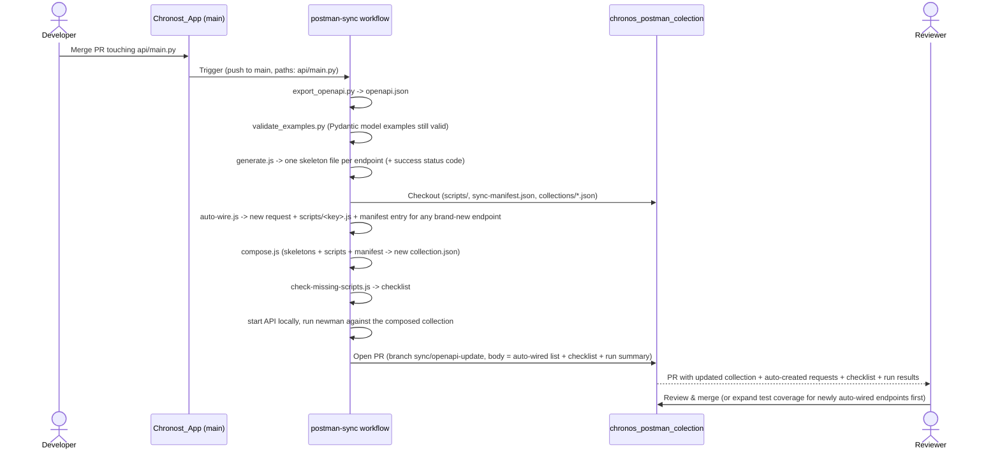

# Chronos — Postman Collections

This repository stores Postman collections for the Todo App API. The collections are intended primarily for **manual testing in Postman**.

Since this repository is used only for manual testing, there is no need for a paid Postman subscription. All changes to collections are made in the free version of Postman and synced to the repository via export and commit.

> Automated API tests are maintained in a separate repository:
> [Chronos_App_Api_Testing](https://github.com/jirivondra/Chronos_App_Api_Testing)

## Repository Structure

```
collections/
  todo-app.postman_collection.json   ← main collection
environments/
  local.postman_environment.json     ← local environment (localhost:8000)
scripts/
  <method>_<path>.js                 ← hand-written pre-request/test scripts, one file per endpoint
sync-manifest.json                   ← maps each endpoint key to the request name it syncs into
```

## Prerequisites — Running the Application Locally

To use these collections and get relevant API responses, you need to have the application running locally.

Clone and set up the application from the [todo_app repository](https://github.com/jirivondra/todo_app) and follow the instructions in its [README](https://github.com/jirivondra/todo_app#readme).

## How to Import the Collections

1. Clone this repository:
   ```bash
   git clone https://github.com/jirivondra/chronos_postman_colection.git
   ```

2. Open Postman → click **Import**

3. Drag and drop or select the files:
   - `collections/todo-app.postman_collection.json`
   - `environments/local.postman_environment.json`

4. In the top right corner of Postman, select the **Todo App - Local** environment

5. Start the application locally and begin testing

## How to Update the Collections

**Method, URL and path changes are automated — including brand-new endpoints.** Whenever `api/main.py` changes in [Chronost_App](https://github.com/jirivondra/Chronost_App), a workflow there regenerates the request shapes from the OpenAPI spec, automatically creates a request + a minimal status-code test for any endpoint that isn't wired up yet, runs the resulting collection with `newman` against a live local instance of the API, and opens a PR here with the update. The PR body lists any newly auto-created endpoint, any request missing a test script, or whose example `body` fields have drifted from the spec (missing a new field, or still sending one that's gone) — plus a pass/fail summary from the live collection run. Review and merge it like any other PR.



If the live collection run fails, the PR still opens (diff stays visible), but the Chronost_App workflow run itself is marked failed so it isn't missed.

The sync never touches `header`, `body`, or the request's test/pre-request scripts, and it never touches folders or requests that aren't listed in `sync-manifest.json` (e.g. the `Errors` folder, or scenario requests like `Get Next Page`) — those stay fully hand-maintained. See [`postman-sync/README.md`](https://github.com/jirivondra/Chronost_App/blob/main/postman-sync/README.md) in Chronost_App for the pipeline implementation details.

**Always manually review a sync PR before merging it, even when the checklist says "nothing to review."** The checklist only catches endpoints with no request or no script wired up — it doesn't verify the request still behaves correctly. Before merging:

1. Check the diff — confirm the changed method/URL actually matches the intended API change
2. Run the collection (Collection Runner) against a local instance of the API and confirm the requests and their tests still pass
3. If the API change added/removed a field, update the request `body` by hand — the sync deliberately never touches it

To change a script:

1. Edit the matching file in `scripts/<method>_<path>.js` (e.g. `scripts/get_todos_id.js`), exporting `prerequest` and/or `test` as template-literal strings
2. Commit and push — the next sync PR will pick it up

A brand-new endpoint needs no manual setup — the moment it appears in the spec, the sync PR already includes a new request (with a realistic example body) and a basic status-code test in `scripts/<key>.js`, wired up in `sync-manifest.json`. After merging that PR:

1. Move the auto-created request to a different folder if `Todos` isn't the right place for it
2. Expand `scripts/<key>.js` beyond the basic status-code check, if useful
3. From then on it stays in sync automatically, exactly like every other endpoint

Everything else not covered by the automated sync (environment values, new folders, error-scenario requests) is still exported and committed manually:

1. Make your changes in Postman
2. Right-click the collection → **Export JSON** → save over `collections/todo-app.postman_collection.json`
3. To export the environment: click `...` next to the environment → **Export** → save over `environments/local.postman_environment.json`
4. Commit and push the changes:
   ```bash
   git add collections/ environments/
   git commit -m "fix: update collection"
   git push
   ```

## Endpoints

| Method | Endpoint | Description |
|--------|----------|-------------|
| GET | `/todos` | List all todos |
| POST | `/todos` | Create a new todo |
| GET | `/todos/{id}` | Get a todo by ID |
| PUT | `/todos/{id}` | Update a todo |
| DELETE | `/todos/{id}` | Delete a todo |

## Authentication

The API uses **HTTP Basic Auth**.
Default credentials for the local environment: `admin` / `secret`

## Request Chaining

The collection is designed to be run in the following order:

1. **Create Todo** → automatically saves `todo_id` to a collection variable
2. **Get Todo by ID** → uses `todo_id`
3. **Update Todo** → uses `todo_id`
4. **Delete Todo** → uses `todo_id` and then clears it

## Tests

Each request includes automated tests (the **Tests** tab in Postman):
- HTTP status code verification
- Response body structure validation
- Data type checks

The **Errors** folder tests error states:
- `404` for a non-existent ID
- `422` for a missing required field
- `401` for missing authentication

To run all tests at once, use the **Collection Runner** (the ▶ button next to the collection).

## Using with Other Tools

The collections are stored in Postman Collection v2.1 format, which is supported by other API clients as well. This means you are not locked into Postman — the same collections can be used in tools like Bruno or Insomnia with a one-time import:

- **Bruno** — guide for importing Postman collections: [docs.usebruno.com](https://docs.usebruno.com/get-started/import-export-data/postman-migration)
- **Insomnia** — supports Postman collection import via File → Import
